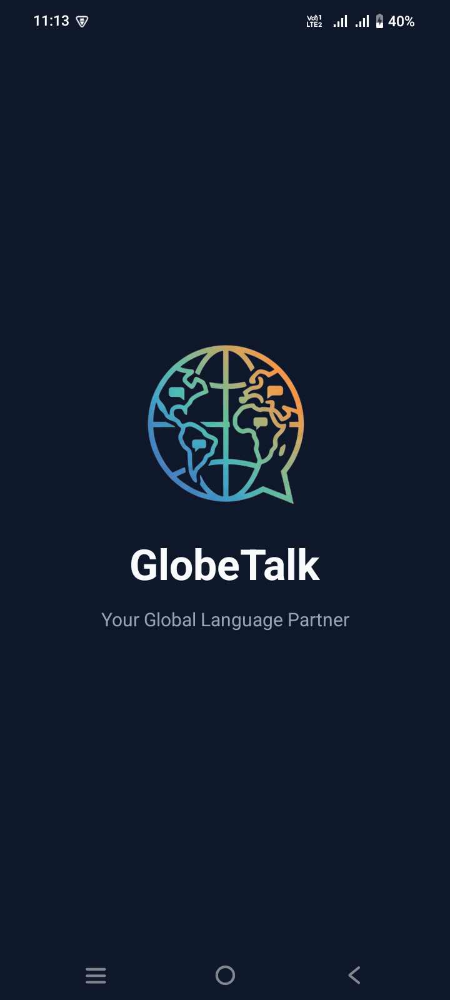
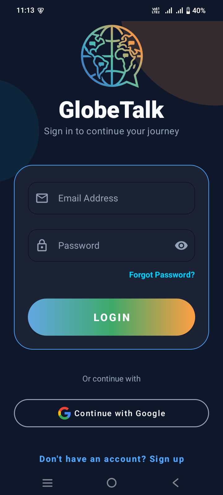
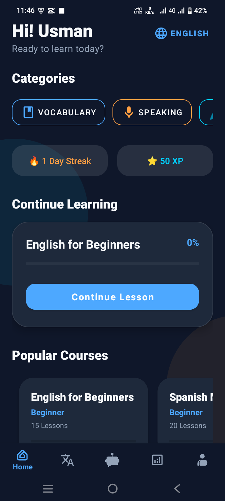
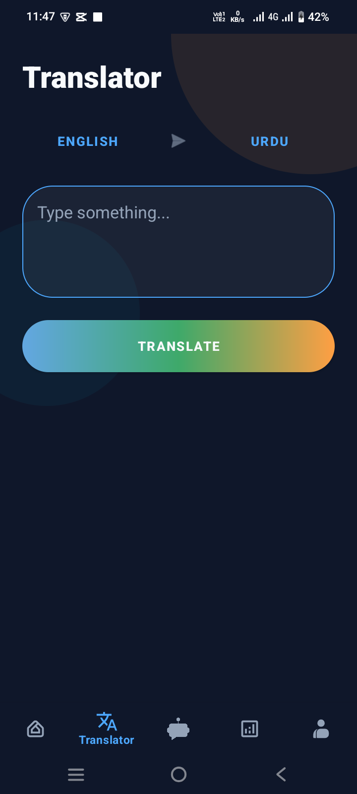
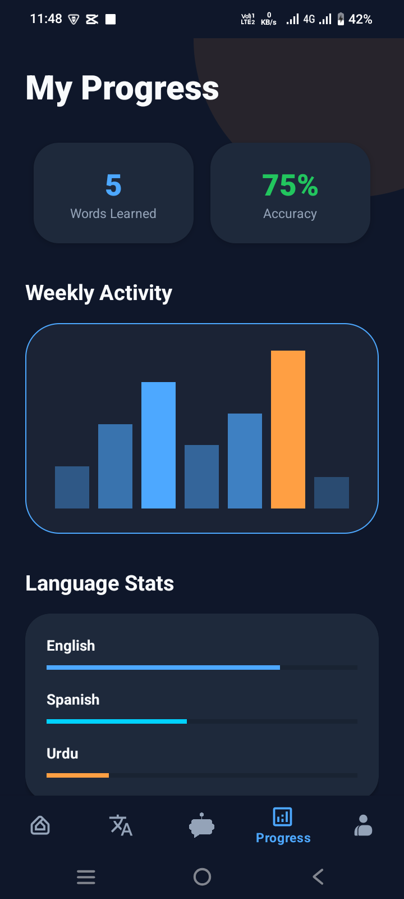
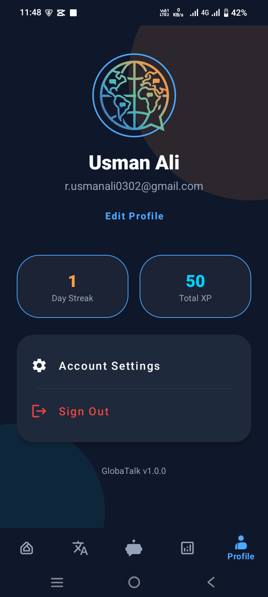
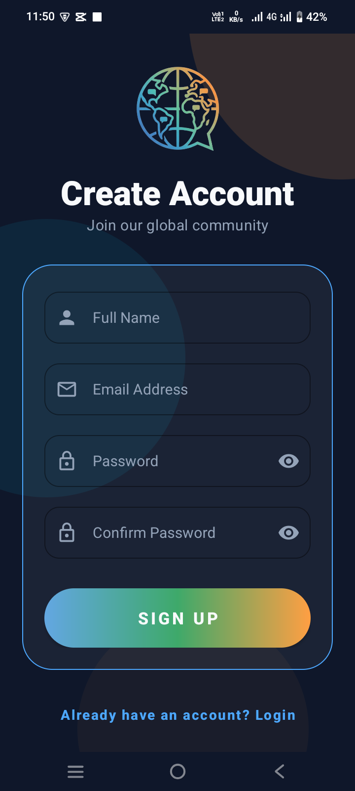

# GlobaTalk - Premium AI-Powered Language Learning App

GlobaTalk is a professional, high-end language learning application designed to help users master new languages through a combination of structured curriculum, interactive tools, and cutting-edge artificial intelligence.

## ✨ Features

*   **💎 Expert UI/UX**: A modern "Cyber-Glassmorphism" aesthetic with immersive background glows and premium typography.
*   **🤖 AI Tutor**: Integrated Google Gemini AI that acts as a 24/7 personal tutor for grammar, vocabulary, and conversation practice.
*   **🌍 Multi-Language Support**: Learn and translate between English, Urdu, Arabic, German, and Spanish.
*   **☁️ Cloud Curriculum**: Real-time synchronization of courses and lessons powered by Firebase.
*   **🔄 On-Device Translator**: Instant offline-ready translation between all supported languages with Text-to-Speech (TTS) support.
*   **📈 Gamified Progress**: Track your learning journey with Day Streaks, XP points, and detailed progress analytics.
*   **🎓 Structured Learning**: Horizontal course browsing, interactive lesson lists, and vocabulary building.
*   **🔐 Secure Authentication**: Fast and safe sign-in via Email/Password or Google.

## 🛠 Tech Stack

*   **Language**: Java
*   **Backend**: Firebase Realtime Database & Authentication
*   **AI**: Google Generative AI (Gemini 1.5 Flash)
*   **ML**: Google ML Kit (On-device Translation)
*   **Database**: Room (Local caching & Offline support)
*   **Architecture**: MVVM (Model-View-ViewModel)
*   **Design**: Material Design 3, Glassmorphism, ConstraintLayout

## 🚀 Getting Started

1.  **Clone the repo**:
    ```bash
    git clone https://github.com/Rusmanali/GlobeTalk_app.git
    ```
2.  **Add your configuration**:
    *   Place your `google-services.json` in the `app/` directory.
    *   Add your Gemini API Key in `AIChatFragment.java`.
3.  **Build and Run**:
    *   Open the project in Android Studio.
    *   Sync Gradle and deploy to an emulator or physical device.

## 📸 Screenshots

<p align="center">
  
  
  
  
</p>
<p align="center">
  
  
  
  
</p>

## 📄 License

This project is licensed under the MIT License - see the LICENSE file for details.

---
Created with ❤️ by **Rusman Ali** and the GlobaTalk Team
